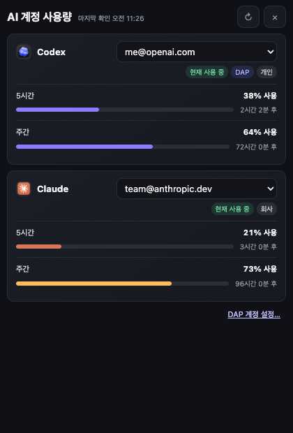

# AI Usage for DAP

로그인된 Codex와 Claude 계정의 구독 사용량과 초기화 시각을 DAP에서 확인하는 대시보드 플러그인입니다.



> [!IMPORTANT]
> 이 저장소에는 UI와 Host bridge가 구현되어 있지만, 현재 공개 DAP Host API에는 `aiAccounts` capability가 없습니다. 지원되는 DAP 앱 버전이 배포되기 전에는 대시보드가 `DAP 지원이 필요합니다`를 표시합니다. 필요한 Host 계약은 [docs/HOST_INTEGRATION.md](docs/HOST_INTEGRATION.md)를 참고하세요.

## Features

- DAP 트레이와 펫 래디얼 메뉴에서 420×620 dark palette 열기
- 서비스별 카드와 연결 계정 선택
- 5시간·주간 사용량, 진행률, 초기화 시각 표시
- 서비스 활성, DAP 사용, 회사·개인 계정 상태 chip
- 조회 계정 변경과 DAP 실제 사용 계정 변경을 분리
- `+ 새 계정 추가…`를 통한 Host 로그인 흐름 연결
- 응답 순서가 바뀌어도 오래된 사용량을 무시하는 request ID 보호
- 미지원·인증 만료·조회 오류·오래된 정보 상태 표시

## Privacy

이 플러그인은 API 사용량 대시보드가 아닙니다.

- API 키, API 조직 비용 또는 개발자 API token usage를 읽지 않습니다.
- 브라우저 cookie, 인증 token, Keychain 또는 CLI credential을 직접 읽지 않습니다.
- 자식 프로세스를 실행하거나 로그인 세션을 복제하지 않습니다.
- 계정 label, 상태, 사용량, reset 시각 등 DAP Host가 제공한 metadata만 palette로 전달합니다.
- credential과 공식 CLI 로그인 세션의 소유권은 항상 DAP Host에 있습니다.

## Preview / Host dependency

플러그인은 `ctx.host.aiAccounts`를 우선 사용하고 이전 실험 구현을 위해 `ctx.host.accounts`도 인식합니다. 권장 canonical API는 다음과 같습니다.

```js
ctx.host.aiAccounts.getOverview()
ctx.host.aiAccounts.getAccountUsage(providerId, accountId)
ctx.host.aiAccounts.addAccount(providerId)
ctx.host.aiAccounts.openAccounts()
```

`getAccountUsage`는 선택 기능입니다. 없으면 overview에 포함된 계정별 사용량을 사용합니다. 전체 schema와 DAP 앱 변경 지점은 [Host integration guide](docs/HOST_INTEGRATION.md)에 있습니다.

## Install

지원되는 DAP 앱 버전에서 저장소 전체를 아래 폴더로 복사합니다.

```text
~/Library/Application Support/dap/plugins/io.github.o-min222.ai_usage/
```

DAP을 재시작하거나 설정에서 플러그인을 다시 활성화합니다. manifest의 `window.palette` 권한을 승인해야 합니다.

## Development

별도 build step이나 runtime dependency는 없습니다. ESM과 palette HTML은 자기완결 파일입니다.

```bash
npm run check
node --check dap_ai_usage/plugin.mjs
```

검증은 manifest, bundled icons, palette script 구문, 정규화 규칙, Host message bridge를 확인합니다.

## Release and catalog

1. `plugin.yaml`과 `package.json` 버전을 함께 갱신합니다.
2. `npm run check`를 실행합니다.
3. public GitHub repository에 변경을 push합니다.
4. 동일 버전 tag를 생성합니다. 예: `git tag v0.1.0 && git push --tags`.
5. `Project-Undonghae/dap-plugins`의 `plugin_catalog.json`에 다음 형태로 PR을 만듭니다.

```json
{
  "id": "io.github.o-min222.ai_usage",
  "name": "AI Usage",
  "description": "로그인된 AI 서비스 계정의 구독 사용량과 초기화 시각을 확인",
  "category": "utility",
  "repo": "o-min222/dap-ai-usage",
  "ref": "v0.1.0"
}
```

Catalog `id`는 `plugin.yaml`과 정확히 같아야 합니다. 실제 배포 전에는 `aiAccounts`를 포함한 DAP 앱 최소 버전을 README와 Host integration 문서에 기록해야 합니다.

## License

[MIT](LICENSE). OpenAI, Anthropic 및 관련 제품명·아이콘은 각 소유자의 상표입니다. 자세한 내용은 [NOTICE.md](NOTICE.md)를 참고하세요.
